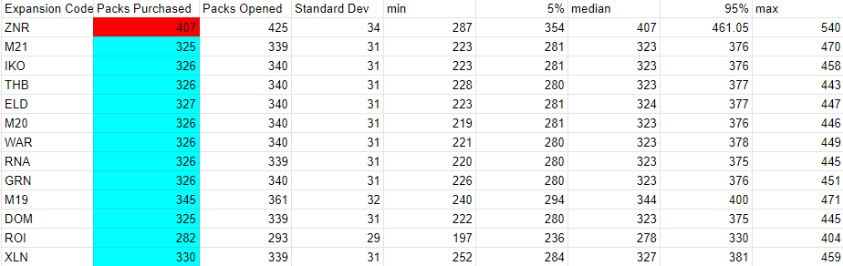

# mtga_completion
The goal of this repo was to answer the ultimate MTGA question: how many packs do you need to purchase to buy a playset of each mythic?
- `10k.csv` shows how many packs to complete each set
- `rare10k.csv` shows how many packs to get a full playset of rares of each set
- `10k-completionist-sequential.csv`shows how many packs to complete every set (this is different from the sum of totals in `10k.csv` as after each set there would be residual resources, thus running them sequentially is needed)
# Factors Considered
- Rare -> mythic upgrade rate varies on set 
- Wildcards (both wheel and pack replacement rates) and the optimal strategy of holding them until completion at that rarity is within reach
- The vault system 
- The pity system, which sets upper bounds on how many 'misses' you can get on a certain upgrade event
- Excess cards at a certain rarity can be converted to gems and serve to buy packs (hence the difference between opened and purchased packs)

# Strategy
The easiest way to solve this is via Monte Carlo. `mtga_set_completion.py` implements an object-oriented abstraction for a players collection. `stats.py` serves as a driver for this: averaging results over multiple sets and calculating standard dev, percentiles, and writing out results. 

# Verification 
We could also verify these results with a system of equations which would consider everything but pity timers and the case where Mythics become the limiting factor (which is **very** improbable). Let column vector `x` solve for the dollar value of the following variables `x = (common, uncommon, rare, mythic, gems, vault)`. As expected, multiplying these values by the number of cards in each rarity for a set gets us very close, and slightly above our experimental results
```
import numpy as np

A = np.array([
    [5, 2, (7/8+3/24), (1/24+1/8), -200, 0],
    [1, 0, 0, 0, 0, -1/1000],
    [0, 1, 0, 0, 0, -3/1000],
    [0, 0, 1, 0, -20, 0],
    [0, 3, 2, 1, 0, -1],
    [0, 0, 0, 0, 200, 0],
             ])
b = np.array([0, 0, 0, 0, 0, 1])
x = np.linalg.solve(A, b)
```
`x = array($.005, $.016, $.1, $5, $.005, $5.298)`
